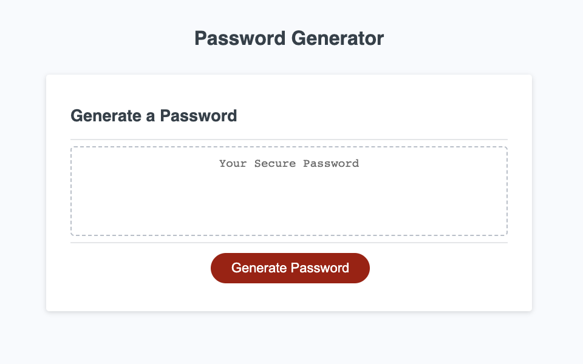

# Password Generator

## Description

The application allows a user to create a custom, randomly generated password using upper and lowercase letters, numbers, and special characters.

Please see 'Usage' for instructions.

## Usage

<ol>
<li>Navigate to the website on [Github Pages](https://exzilium.github.io/password-generator/).</li>
<li>Click "Generate Password"</li>
<li>Follow the prompts</li>
<ul>
<li>Choose number of characters to include (8-128)</li>
<li>Choose the type of characters to use (Uppercase, lowercase, numbers, special characters)</li>
</ul>
<li>Confirm your selections</li>
<li>The password will appear in the on-screen box. Copy it and enjoy!</li>
</ol>

## Credits

<ul>
<li>MDN web docs for [JavaScript](https://developer.mozilla.org/en-US/docs/Web/JavaScript)</li>
<li>Foolish Developer's [Random Password Generator using Javascript](https://dev.to/code_mystery/random-password-generator-using-javascript-6a)</li>
<li>Geeks for Geeks [How to Generate a Random Password using JavaScript](https://www.geeksforgeeks.org/how-to-generate-a-random-password-using-javascript/)</li>
</ul>

## License

N/A
